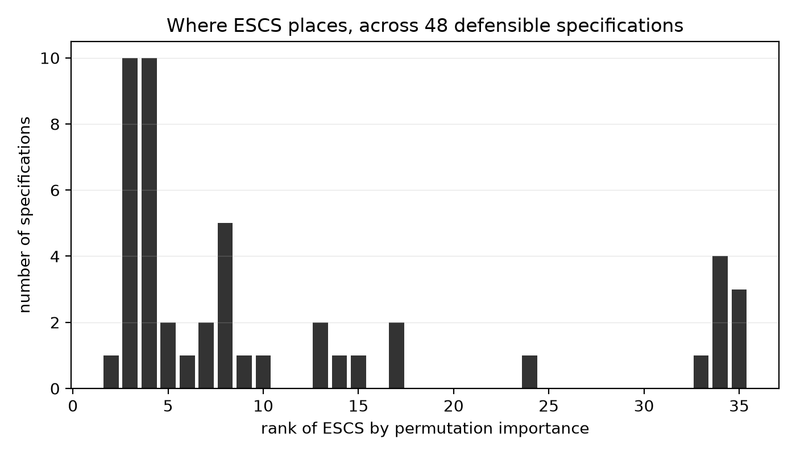
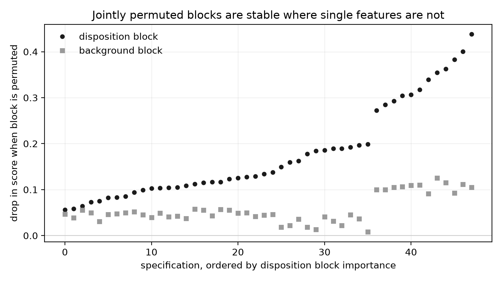
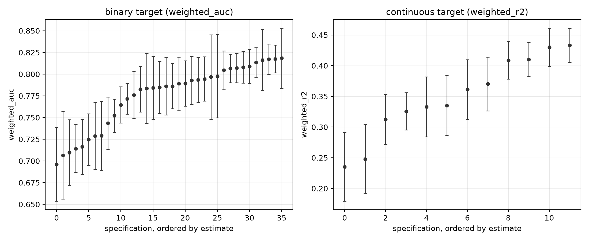

# pisa-specification-sensitivity

How far does a conclusion about educational attainment move across modelling
choices that are all individually defensible?

This repository does not ask whether low mathematics performance in PISA 2022 UK
data can be predicted. That question is settled and uninteresting. It asks how
much the answer a researcher would report depends on decisions that are rarely
reported at all: which plausible value to analyse, whether to apply the survey
weights, which model family to fit, whether to model a score or a threshold, and
where to place the threshold.

The deliverable is a range, not a point estimate.

## The specification grid

Five axes are crossed over one fixed research question and one fixed dataset.
The threshold axis applies only to the binary target, so the grid is not a full
cross: 36 binary cells and 12 continuous cells, 48 in total. No sampling is
required to stay inside the intended budget.

| Axis | Levels | Rationale |
|---|---|---|
| Plausible value handling | `pv1_only`, `pooled_rubin` | PISA publishes ten plausible values per domain. Analysing one treats a posterior draw as a measurement. Pooling combines all ten under Rubin's rules. |
| Survey weights | `weighted`, `unweighted` | `W_FSTUWT` makes estimates population-representative. Omitting it is common practice in applied machine learning work on PISA. |
| Model family | `pruned_tree`, `random_forest`, `gradient_boosting` | Increasing flexibility, from a single pruned tree to a histogram gradient booster. |
| Target formulation | `binary`, `continuous` | Below-threshold classification against direct regression on the score. |
| Threshold | `level_1a` (357.77), `level_2` (420.07), `level_3` (482.38) | The OECD minimum-proficiency cut plus the adjacent published band boundaries. |

Hyperparameters are held fixed within each model family across the whole grid.
Allowing tuning effort to vary would confound the model-family axis with search
budget.

## Headline result

Across 48 specifications fitted to 12,972 UK students and 35 features, the study
produced a two-part result. The reported quantity is unstable. The substantive
conclusion underneath it is not.

### The single-feature ranking is unstable, and the threshold drives it

| Quantity | Result |
|---|---:|
| Rank of ESCS, best case | 2nd of 35 |
| Rank of ESCS, worst case | 35th of 35 |
| Median rank of ESCS | 6.5 |
| Specifications placing ESCS first | 0 of 48 |
| Specifications placing ESCS in the top three | 11 of 48 |

The distribution is bimodal. ESCS sits between third and eighth in 30 of the 48
specifications, then collapses to last place in eight of them.

Movement is attributed by comparing only cells that are identical except on the
axis in question, and averaging the within-set range. Different axes drive
different conclusions:

| Axis | Mean movement in ESCS rank | Mean movement in performance |
|---|---:|---:|
| Threshold | 21.25 places | 0.020 |
| Model family | 11.56 places | 0.083 |
| Plausible value handling | 5.33 places | 0.008 |
| Survey weights | 2.75 places | 0.037 |

Where the low-performance line is drawn moves the socioeconomic ranking by 21
places on average, and by 33 at worst, while barely moving predictive
performance. That dichotomising a continuous outcome costs information is long
established (Royston, Altman and Sauerbrei, 2006); what the grid adds is that the
cost falls on the importance ranking rather than on predictive accuracy. Model family does the reverse. This matters because threshold
placement is not a model choice: no search over well-performing models can
reveal it, because the outcome variable itself differs across that axis.

### The instability is an artefact of the measure, not of the data

ESCS correlates 0.807 with HISEI, 0.753 with HOMEPOS and 0.739 with PAREDINT,
because OECD constructs ESCS from those indices. Permuting ESCS alone leaves
three substitutes in the matrix, so the model barely degrades and ESCS appears
unimportant. Permuting the whole block jointly removes the substitutes.

| Block permuted jointly | Median drop | Range | Positive in |
|---|---:|---:|---:|
| Family background (ESCS, HISEI, HOMEPOS, PAREDINT, ICTRES) | 0.047 | 0.008 to 0.126 | 48 of 48 |
| Mathematics disposition (MATHEFF, FAMCON) | 0.136 | 0.056 to 0.438 | 48 of 48 |

Family background matters in every single specification. Mathematics disposition
matters more in every single specification, without exception. The ordering never
reverses across any combination of plausible value handling, weighting, model
family, target formulation or threshold.

So the specification curve did not find that the substantive conclusion is
fragile. It found that the reported statistic is fragile. A study reporting the
rank of ESCS reports something that moves 33 places on an arbitrary threshold
choice; a study reporting jointly permuted blocks reports something that does not
move at all. The instability was diagnostic of the metric.

### Performance spans a wide band

| Target | Metric | Range across the grid | Median |
|---|---|---:|---:|
| Binary | Weighted AUC | 0.696 to 0.818 | 0.786 |
| Continuous | Weighted R² | 0.235 to 0.433 | 0.348 |

The continuous R² nearly doubles from one end of the grid to the other.
Dichotomising the outcome also suppresses measured importance: the background
block scores a median 0.106 under the continuous target against 0.040 to 0.047
under the three binary thresholds.

### Analysing one plausible value understates uncertainty

In 23 of 24 matched comparisons, pooling all ten plausible values widened the
confidence interval. The median interval was 1.19 times wider once
between-imputation variance was restored, and 1.58 times wider at the extreme.
Among pooled cells, between-imputation variance was a median 25.8% of total
variance and reached 55.0%. A single-plausible-value analysis discards that
component entirely.

### Replicate weights made almost no difference here

PISA supplies 80 Fay replicate weights for design-based standard errors. Using
them in place of an ordinary bootstrap of the evaluation partition changed
interval width by a median factor of 0.998, ranging from 0.915 to 1.084, and
produced a wider interval in only 11 of 24 comparisons.

This is a null result and is reported as one. It says that for held-out AUC and
R² on this sample, the naive interval was already about the right width. It does
not generalise to means, proportions or regression coefficients, where design
effects in PISA are known to be substantial. The replicate weights vary only the
evaluation weighting; the model is held fixed.

## Contribution

Stated in order of strength, and the third is weaker than the first two.

**One. The threshold is a consequential specification choice that no existing
method can detect.** Where the low-performance line is drawn moves the importance
ranking by 21.25 places on average and 33 at worst, while moving predictive
performance by 0.020. Threshold placement is almost never reported, because it
does not present itself as an analytical decision. It is also invisible to the
entire model-multiplicity literature: model class reliance, variable importance
clouds and Rashomon methods all search over models that fit the same outcome, and
the threshold changes what the outcome is. No search over well-performing models
can recover a choice made before the models were fitted.

**Two. A specification curve can separate a fragile statistic from a fragile
conclusion.** The reported ranking moves 33 places across the grid. The
substantive ordering does not move at all: family background matters in 48 of 48
specifications, and mathematics disposition exceeds it in 48 of 48. Reporting
both tells a reader that the instability was in the measuring instrument rather
than in the world, which is actionable. A specification curve that stops at
demonstrating variability leaves the reader with nothing to do about it.

**Three. A demonstration of known theory in a case that matters.** That
correlated predictors distort permutation importance has been established since
Strobl and colleagues in 2008, and grouped permutation has been available since
Gregorutti and colleagues in 2015. Neither is contributed here. What is shown is
the severity on the most widely used variable in education research: single-feature
permutation moves ESCS from 2nd to 35th of 35, and blocking it by OECD's own
published construction rule removes the artefact entirely. This is a worked
example, not a method.

The first two are the argument. The third is evidence for the second.

## Reproducing

The PISA data is not distributed here. Acquire it first:

    python scripts/download_data.py

That prints the OECD source, the file to download, and the filter that produces
the UK extract. Verify a prepared extract with:

    python scripts/download_data.py --verify data/uk_pisa_2022.csv

Then install and run the grid:

    pip install -e '.[test]'
    pisa-specsens --data data/uk_pisa_2022.csv --out results/v2

The command writes `grid_results.csv`, `grid_results.json` and `summary.json`
into the named directory, and refuses to write into a directory that already
holds files. The output behind every number reported above is published under
[results/v2](results/v2), so the figures and the headline table can be checked
without obtaining the PISA data. Results directories name a version; overwriting one silently would
make a published figure impossible to trace to the run that produced it.

Figures are regenerated from a completed results directory:

    pip install -e '.[figures]'
    jupyter nbconvert --to notebook --execute notebooks/figures.ipynb

Run the test suite, which is offline and needs no PISA data:

    pytest

The full grid took 7.5 minutes on an Apple silicon laptop with parallel fitting
enabled. Pooled cells fit ten models each, so 48 cells are 264 fits.

## Repository structure

    src/pisa_specsens/
        config.py           specification axes, proficiency cuts, constants
        data.py             column-restricted loading of the UK extract
        preprocessing.py    feature selection, splitting, leakage-free imputation
        models.py           estimators and permutation importance
        pooling.py          Rubin's rules and bootstrap variance
        grid.py             execution of one cell and of the whole grid
        aggregate.py        rank stability and axis attribution
        cli.py              entry point with the overwrite guard

    tests/                  offline tests on small synthetic frames
    scripts/                data acquisition and verification
    docs/related_research.md what the prior literature establishes
    results/v2/             the grid output behind every number reported here
    notebooks/figures.ipynb figure production only, no analysis

Training and analysis call the same preprocessing functions. Two specifications
differ only by their declared axes, never by an incidental difference in data
handling.

## Method notes

Features are the 33 standard PISA derived indices rather than raw questionnaire
items, which keeps the feature set documented and comparable to other PISA work.
Two indices exceeding 30% missingness (`LEARRES`, `SDLEFF`) are dropped, because
the PISA questionnaire rotates forms and those items were not put to every
student. Gender and UK nation are one-hot encoded, giving 35 columns.

Median imputation is fitted on the training partition and applied unchanged to
validation and test, so no information from held-out data reaches a model.

Importance is measured by permutation on the held-out partition, not by the
built-in impurity importance. Trees, forests and boosters compute impurity
importance by different internal definitions, so those numbers are not comparable
across the model-family axis. Permutation importance asks the same question of
every model: how much does performance fall when this feature is shuffled.

Importance is also measured for blocks of features permuted jointly, using a
single shared row permutation per block so that within-block correlation survives
while the block's relationship to the outcome is broken. This is grouped
permutation importance as introduced by Gregorutti, Michel and Saint-Pierre, and
it addresses the correlated-predictor bias that Strobl and colleagues diagnosed
and answered with conditional permutation. The estimator is theirs, not this
study's. What is applied here is the choice of blocks: the background block is
ESCS together with HISEI, HOMEPOS and PAREDINT, which are the three indices OECD
combines to construct ESCS, so the block is defined by the published construction
rule rather than by analyst judgement.

Uncertainty is reported two ways. The bootstrap resamples the evaluation
partition as if the sample were simple random. The design-based interval uses
PISA's 80 Fay replicate weights with a coefficient of 0.5, giving a variance
denominator of 20. Both hold the fitted model fixed.

The binary target marks students below a published OECD proficiency cut. It is
not a median split of the score distribution.

## Related work

The method here is not new, and neither is applying it to PISA. Specification
curve analysis was set out by Simonsohn, Simmons and Nelson, and the closely
related multiverse analysis by Steegen, Tuerlinckx, Gelman and Vanpaemel. Both
argue that a single reported specification is one draw from a distribution the
reader never sees.

Robitzsch has already run a specification curve on PISA mathematics. That study
crosses five axes over the PISA 2018 scaling model, covering the functional form
of the item response model, country-level differential item functioning, missing
item responses, item selection and test position effects, and reports that model
uncertainty affects country means about as much as sampling error does. It is the
closest precedent to this repository and differs in what it varies and what it
tracks: it varies psychometric scaling decisions and tracks country distribution
parameters, whereas this grid varies decisions downstream of scaling and tracks a
feature importance ranking.

The plausible value axis is not hypothetical. Rutkowski, Gonzalez, Joncas and
von Davier document that secondary analyses of international large-scale
assessments routinely mishandle plausible values and sampling weights. This study
measures what that mishandling costs on one dataset rather than restating that it
occurs.

The weakness of the importance measure used here is also documented. Hooker,
Mentch and Zhou show that permuting a feature independently of its correlates
forces the model to extrapolate into regions with little data, which distorts
importance for correlated features. That applies directly to the results above
and is recorded in the limitations.

- Simonsohn, U., Simmons, J. P. and Nelson, L. D. (2020). Specification curve
  analysis. *Nature Human Behaviour* 4(11), 1208-1214.
  [doi:10.1038/s41562-020-0912-z](https://doi.org/10.1038/s41562-020-0912-z)
- Steegen, S., Tuerlinckx, F., Gelman, A. and Vanpaemel, W. (2016). Increasing
  transparency through a multiverse analysis. *Perspectives on Psychological
  Science* 11(5), 702-712.
  [doi:10.1177/1745691616658637](https://doi.org/10.1177/1745691616658637)
- Rutkowski, L., Gonzalez, E., Joncas, M. and von Davier, M. (2010).
  International large-scale assessment data: issues in secondary analysis and
  reporting. *Educational Researcher* 39(2), 142-151.
  [doi:10.3102/0013189X10363170](https://doi.org/10.3102/0013189X10363170)
- Robitzsch, A. (2022). Exploring the multiverse of analytical decisions in
  scaling educational large-scale assessment data: a specification curve analysis
  for PISA 2018 mathematics data. *European Journal of Investigation in Health,
  Psychology and Education* 12(7), 731-753.
  [doi:10.3390/ejihpe12070054](https://doi.org/10.3390/ejihpe12070054)
- Gregorutti, B., Michel, B. and Saint-Pierre, P. (2015). Grouped variable
  importance with random forests and application to multiple functional data
  analysis. *Computational Statistics and Data Analysis* 90, 15-35.
  [doi:10.1016/j.csda.2015.04.002](https://doi.org/10.1016/j.csda.2015.04.002)
- Strobl, C., Boulesteix, A.-L., Kneib, T., Augustin, T. and Zeileis, A. (2008).
  Conditional variable importance for random forests. *BMC Bioinformatics* 9, 307.
  [doi:10.1186/1471-2105-9-307](https://doi.org/10.1186/1471-2105-9-307)
- Royston, P., Altman, D. G. and Sauerbrei, W. (2006). Dichotomizing continuous
  predictors in multiple regression: a bad idea. *Statistics in Medicine* 25(1),
  127-141. [doi:10.1002/sim.2331](https://doi.org/10.1002/sim.2331)
- Dong, J. and Rudin, C. (2020). Exploring the cloud of variable importance for
  the set of all good models. *Nature Machine Intelligence* 2(12), 810-824.
  [doi:10.1038/s42256-020-00264-0](https://doi.org/10.1038/s42256-020-00264-0)
- Hooker, G., Mentch, L. and Zhou, S. (2021). Unrestricted permutation forces
  extrapolation: variable importance requires at least one more model, or there
  is no free variable importance. *Statistics and Computing* 31(6), 82.
  [doi:10.1007/s11222-021-10057-z](https://doi.org/10.1007/s11222-021-10057-z)

## What would strengthen this

Four things would materially change what can be claimed, and none is implemented.

**Conditional permutation or a knockoff filter.** Grouped permutation removes
substitution within a declared block but not across blocks, and the blocks are
declared by the analyst. A conditional measure would remove the declaration step.
Hooker, Mentch and Zhou argue that no correlation-robust importance is available
without fitting at least one additional model; this study fits none.

**Refitting per replicate weight.** The design-based intervals re-evaluate a fixed
model under each of the 80 replicate weights. A full design-based analysis refits
the model 80 times. The null design effect reported above should be re-examined
under refitting before it is relied on.

**A second country and a second cycle.** Every number here is UK PISA 2022. The
threshold result is the one most likely to generalise, because it follows from
dichotomising a continuous outcome rather than from anything specific to Britain,
but that is an argument rather than a finding.

**Tuning as a sixth axis.** Hyperparameters are fixed so that search budget cannot
be confounded with the specification axes. That choice removes a source of
variation rather than measuring it.

## Limitations

Importance rankings are not causal claims. A feature ranking highly means the
model leans on it, not that changing it would change attainment. Mathematics
self-efficacy and mathematics attainment plainly reinforce each other, and
nothing here separates the directions.

This is one country and one cycle. UK PISA 2022, 12,972 students after
restricting to cases with a final student weight. Nothing here establishes that
the same instability appears in other countries or other years, and the ranking
results in particular should be expected to differ where the questionnaire
composition differs.

Confidence intervals come from bootstrapping the evaluation partition with the
fitted model held fixed. They capture evaluation uncertainty and, for pooled
cells, between-imputation uncertainty. They do not capture uncertainty from
refitting the model, so they are narrower than a full accounting would give.

The replicate weights are applied only to re-evaluate a fixed model, not to refit
it 80 times. A full design-based analysis would refit per replicate, which the
grid does not do on cost grounds. The reported null design effect should be read
with that restriction in mind.

Permutation importance is unreliable when features are strongly correlated,
because shuffling one leaves a correlated substitute available to the model and
forces it to extrapolate (Hooker, Mentch and Zhou, 2021).
Several indices here are correlated by construction. `HOMEPOS` is a component of
`ESCS`, so the two carry overlapping information, and the eight specifications
placing `ESCS` last should be read with that in mind rather than as evidence that
background does not matter. Part of the ranking instability reported above is
attributable to feature correlation rather than to the specification axes alone.
The grouped permutation reported above is a partial remedy, not a complete one:
it removes substitution within a declared block but does not address correlation
across blocks, and the blocks are declared by the analyst rather than discovered.
A conditional or knockoff-based measure, or the additional model that Hooker,
Mentch and Zhou argue is unavoidable, would be the fuller answer. This study
implements none of those.

The grid holds hyperparameters fixed. A study varying tuning budget as a sixth
axis would likely find further movement.

## Deliberately not included

No causal identification strategy. No attempt to argue that any feature drives
attainment.

No hyperparameter search. Tuning is held fixed so that it cannot be confounded
with the specification axes.

No country comparison, no trend across cycles, and no school-level or
teacher-level modelling. The PISA school and teacher files are not read.

No PISA data. The extract is roughly 53MB and is not redistributed here.

No conditional variable importance, knockoff filter, or model class reliance
computation. The grouped permutation is the only correlation remedy implemented.

No recommendation about which specification is correct. The point of the grid is
that several are defensible, that they disagree about the reported statistic, and
that they nonetheless agree about the substantive ordering once the statistic is
measured on blocks rather than single constructed indices.

## Licence

MIT. See [LICENSE](LICENSE).
